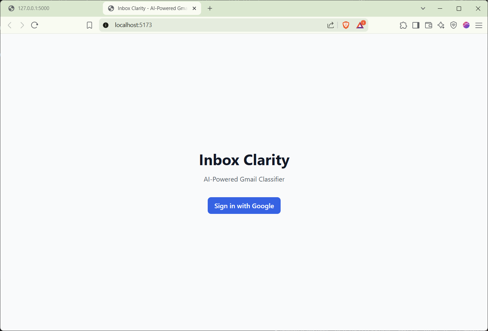
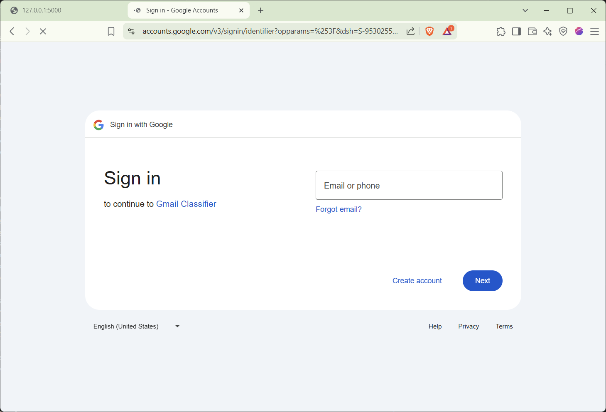
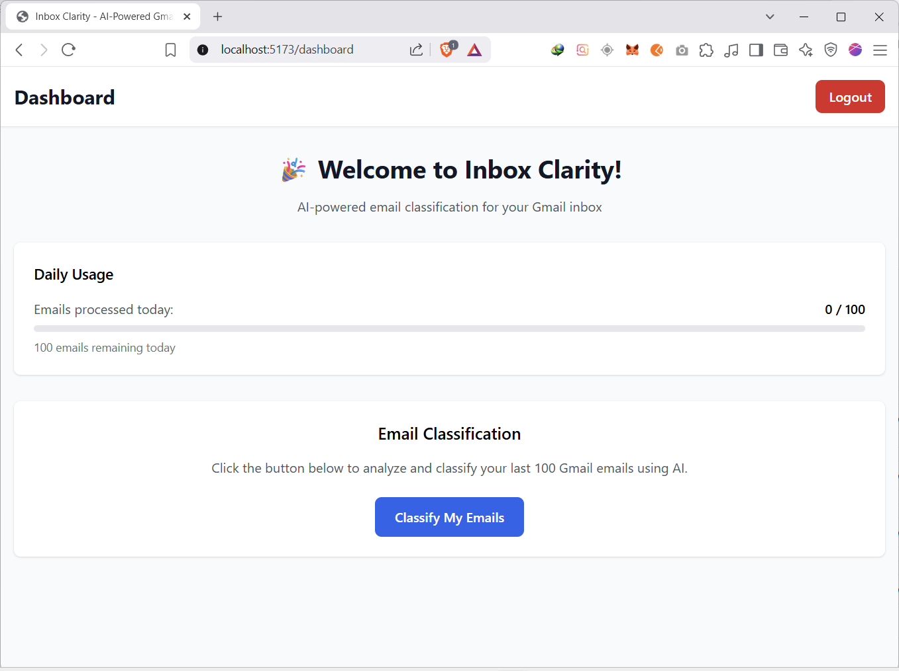
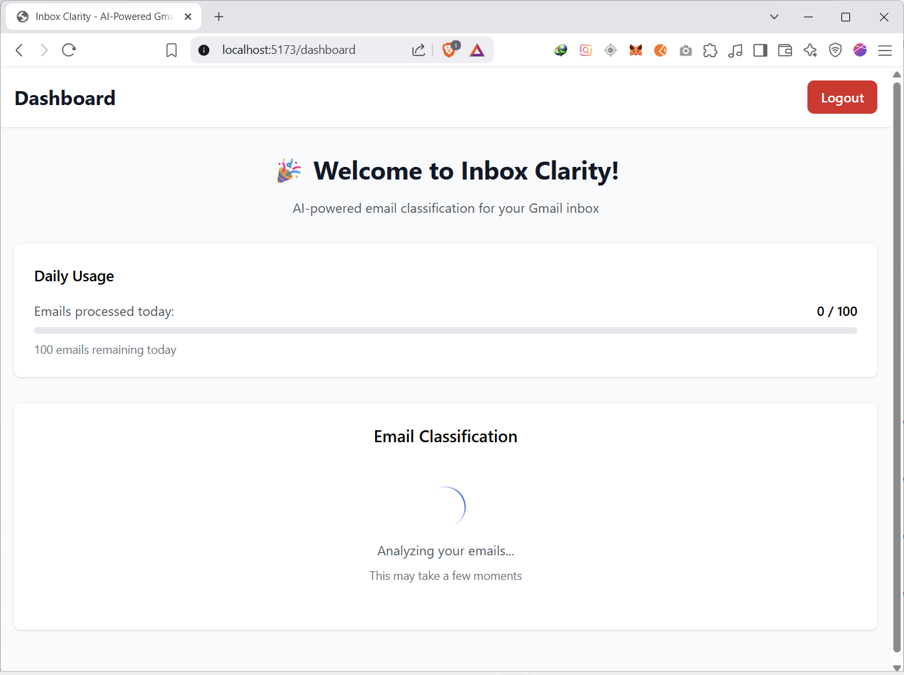
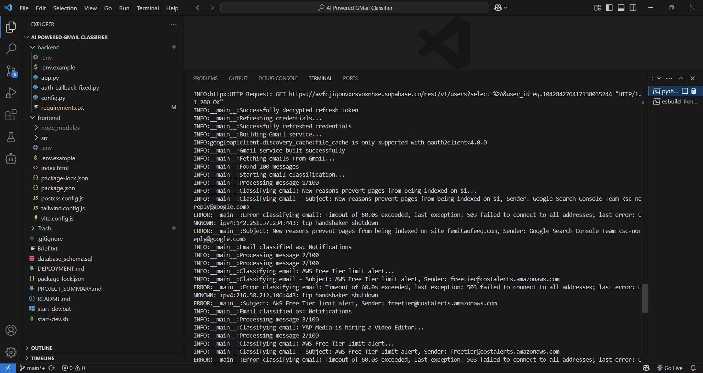
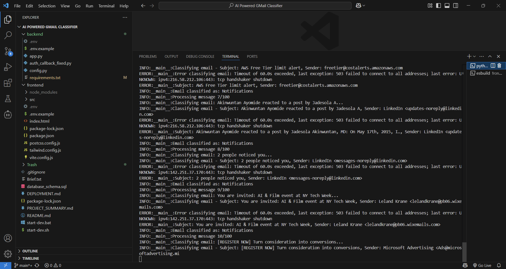
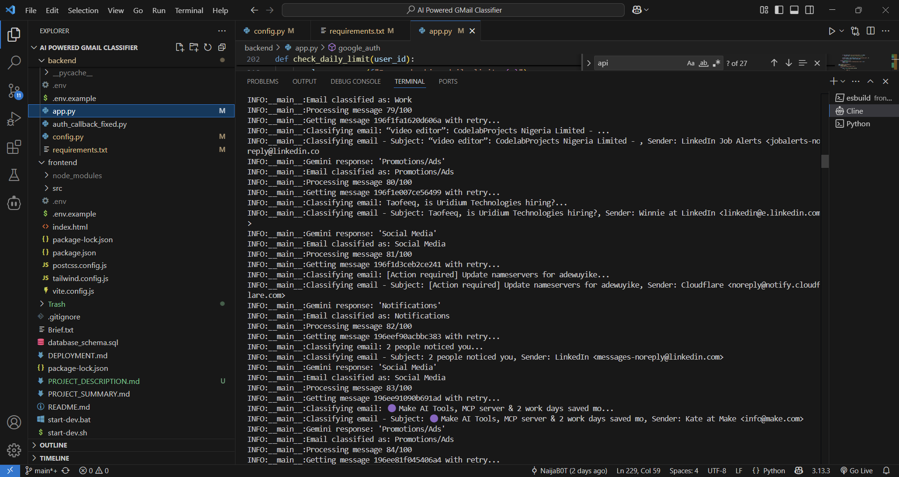
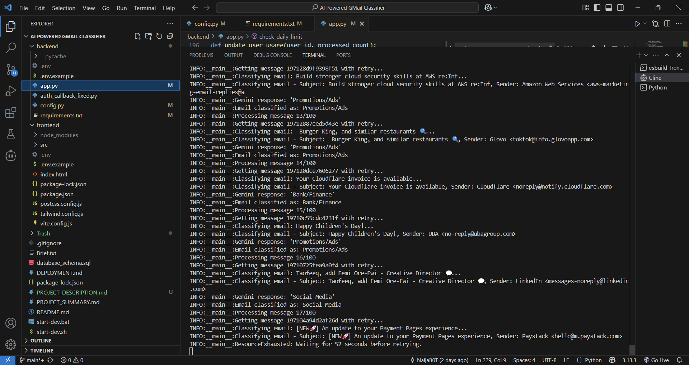

# Production Deployment Guide

## Prerequisites

1. **Domain and SSL Certificate**
   - Register a domain name
   - Set up SSL certificate (Let's Encrypt recommended)

2. **Server Requirements**
   - Ubuntu 20.04+ or similar Linux distribution
   - Python 3.8+
   - Node.js 18+
   - Nginx
   - PM2 (for process management)

3. **External Services**
   - Google Cloud Console project
   - Supabase project
   - Google Gemini API access

## Environment Setup

### 1. Server Configuration

```bash
# Update system
sudo apt update && sudo apt upgrade -y

# Install Python and Node.js
sudo apt install python3 python3-pip nodejs npm nginx -y

# Install PM2 globally
sudo npm install -g pm2

# Create application directory
sudo mkdir -p /var/www/inbox-clarity
sudo chown $USER:$USER /var/www/inbox-clarity
```

### 2. Application Deployment

```bash
# Clone repository
cd /var/www/inbox-clarity
git clone https://github.com/your-github-username/inbox-clarity.git . # Replace with your forked repository URL

# Backend setup
cd backend
python3 -m venv venv
source venv/bin/activate
pip install -r requirements.txt

# Frontend setup
cd ../frontend
npm install
npm run build
```
### 3. Environment Variables

Create `/var/www/inbox-clarity/backend/.env`:
```
FLASK_ENV=production
GOOGLE_CLIENT_ID=your-production-client-id
GOOGLE_CLIENT_SECRET=your-production-client-secret
GEMINI_API_KEY=your-gemini-api-key
SUPABASE_URL=your-supabase-url
SUPABASE_SERVICE_ROLE_KEY=your-supabase-service-key
SECRET_KEY=your-production-secret-key
ENCRYPTION_KEY=your-production-encryption-key
CORS_ORIGINS=https://yourdomain.com
```

### 4. Process Management

Create PM2 ecosystem file `/var/www/inbox-clarity/ecosystem.config.js`:
```javascript
module.exports = {
  apps: [{
    name: 'inbox-clarity-backend',
    cwd: '/var/www/inbox-clarity/backend',
    script: 'venv/bin/python',
    args: 'app.py',
    env: {
      FLASK_ENV: 'production'
    },
    instances: 1,
    autorestart: true,
    watch: false,
    max_memory_restart: '1G'
  }]
}
```

Start the application:
```bash
pm2 start ecosystem.config.js
pm2 save
pm2 startup
```

### 5. Nginx Configuration

Create `/etc/nginx/sites-available/inbox-clarity`:
```nginx
server {
    listen 80;
    server_name yourdomain.com www.yourdomain.com;
    return 301 https://$server_name$request_uri;
}

server {
    listen 443 ssl;
    server_name yourdomain.com www.yourdomain.com;

    ssl_certificate /path/to/ssl/cert.pem;
    ssl_certificate_key /path/to/ssl/private.key;

    # Frontend
    location / {
        root /var/www/inbox-clarity/frontend/dist;
        try_files $uri $uri/ /index.html;
    }

    # Backend API
    location /api/ {
        proxy_pass http://localhost:5000;
        proxy_set_header Host $host;
        proxy_set_header X-Real-IP $remote_addr;
    }

    # Auth endpoints
    location /auth/ {
        proxy_pass http://localhost:5000;
        proxy_set_header Host $host;
        proxy_set_header X-Real-IP $remote_addr;
    }
}
```

Enable the site:
```bash
sudo ln -s /etc/nginx/sites-available/inbox-clarity /etc/nginx/sites-enabled/
sudo nginx -t
sudo systemctl reload nginx

## Screenshots

### Landing Page


### Dashboard - Initial View


### Dashboard - Categories


### Dashboard - Email Details


### Dashboard - Email Classification in Progress


### Dashboard - Classified Emails


### Privacy Policy Page


### OAuth Consent Screen

```
